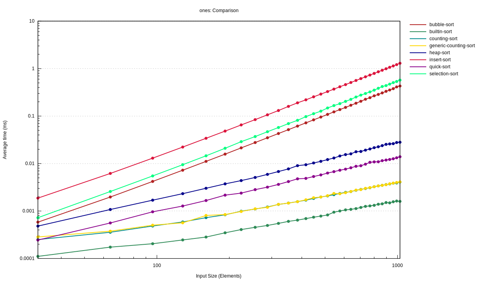
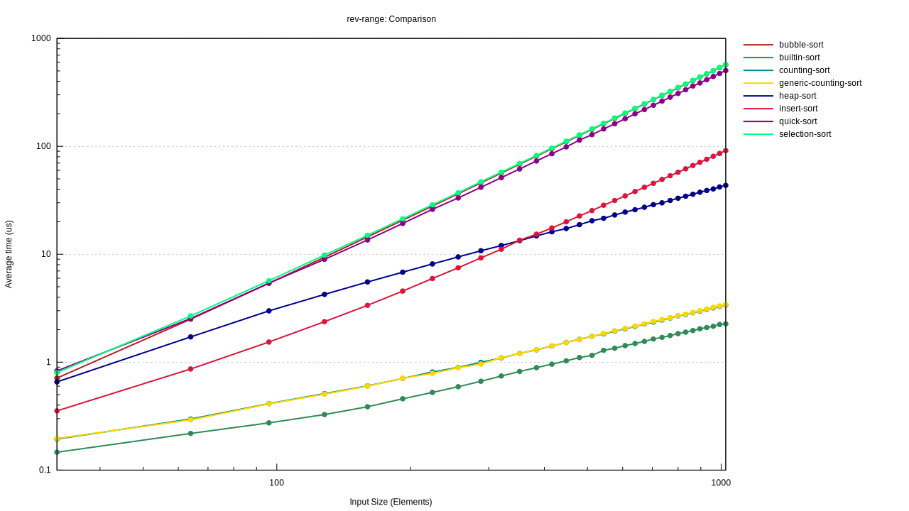
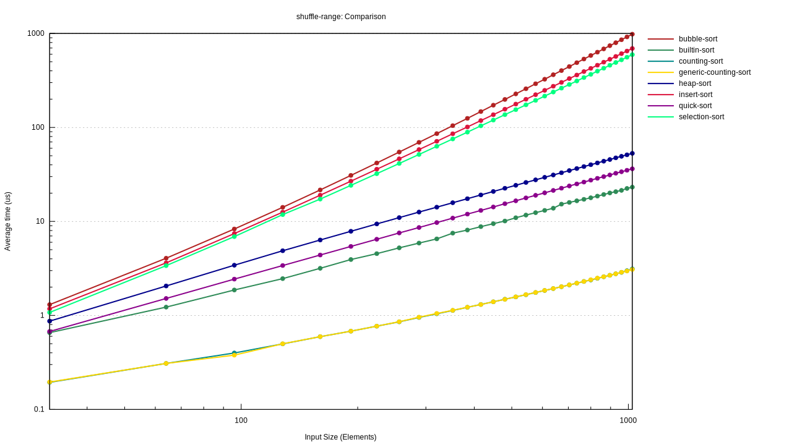
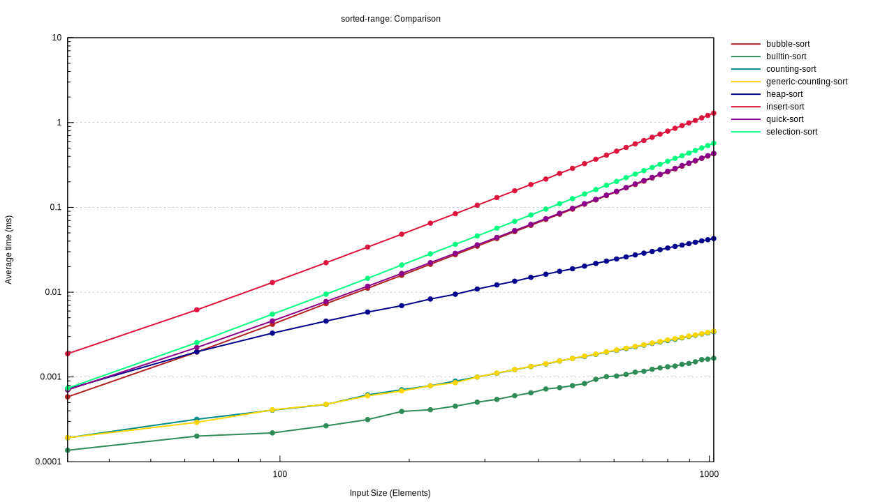

The goal is to measure performance of various sorting algorithms
with Rust for Rosettacode [Compare sorting algorithms
performance](https://rosettacode.org/wiki/Compare_sorting_algorithms%27_performance).

Libraries used: 

- [The-Algorithms-Rust](https://github.com/TheAlgorithms/Rust), for
  the sorting algorithms implementations.

- [criterion](https://github.com/bheisler/criterion.rs), for
  benchmarking, analyzing, measuring and plotting performance.

- [rand](https://github.com/rust-random/rand), for shuffling the
  sequences.

-----------------------------------------------------------------

`src/lib.rs` defines the basic wrappers around the sorting and
sequence generation algorithms, such that we can automate the process
of benchmarking them; then we can use `benchs/main.rs` which uses
`criterion` to do all the heavy lifting. 

